### PyTorch Tensor 그래프
  
* PyTorch는 `그래프`를 만들고, 매개변수를 전달하여 연산 수행

### 신경망 & 활성함수  
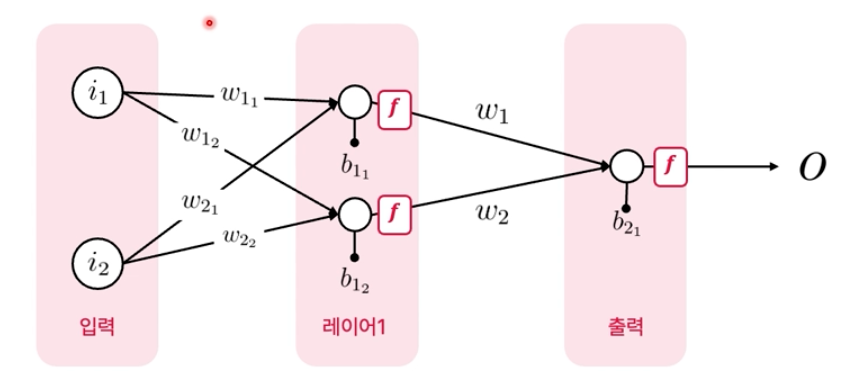

### MNIST 모델 학습  
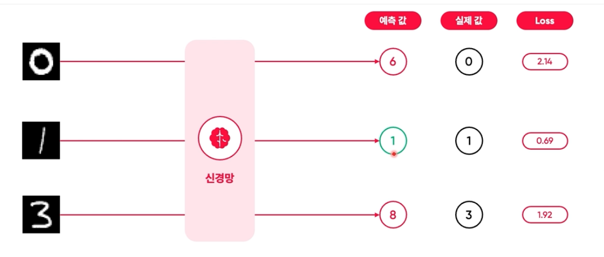
* 학습 과정 = loss값을 최소화  

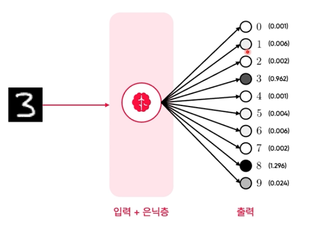  
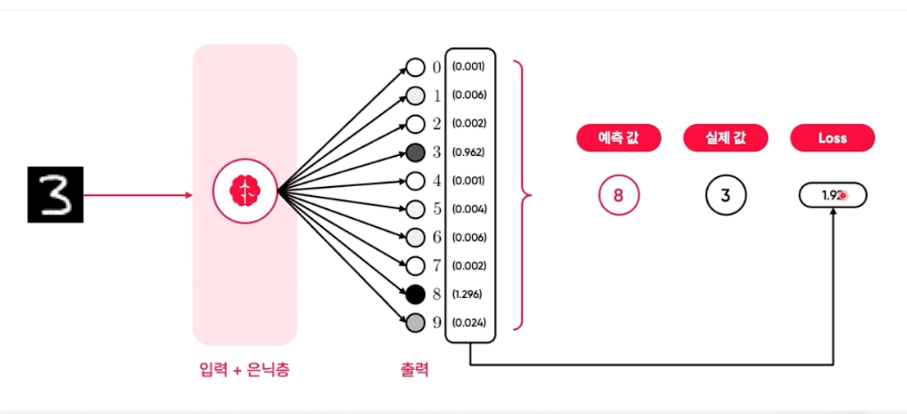  
* 예측값과 실제값이 커지면 커질수록 loss값이 커짐

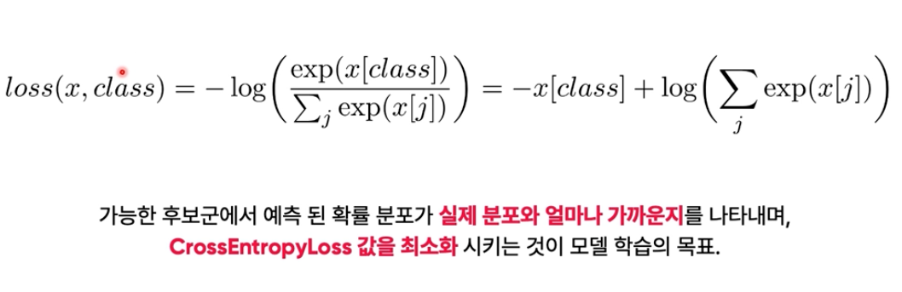
* CrossEntropyLoss
  * 모델의 출력에서 실제 정답 값을 제외한 모든 값의 합산에 로그를 적용한 값 
  

  
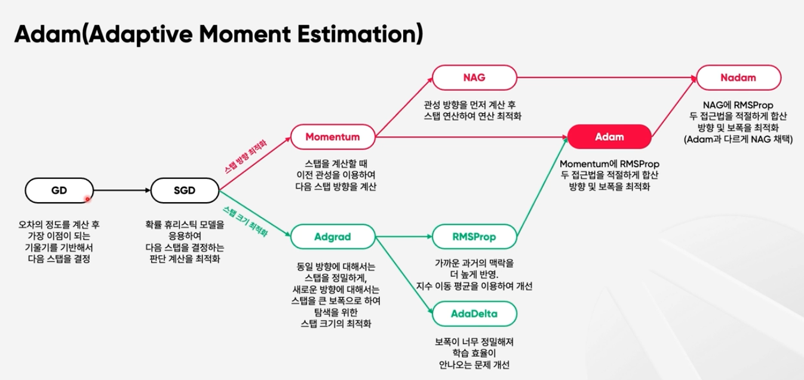

### 활성함수

* 활성함수가 없는 선형 신호의 출력 계산  
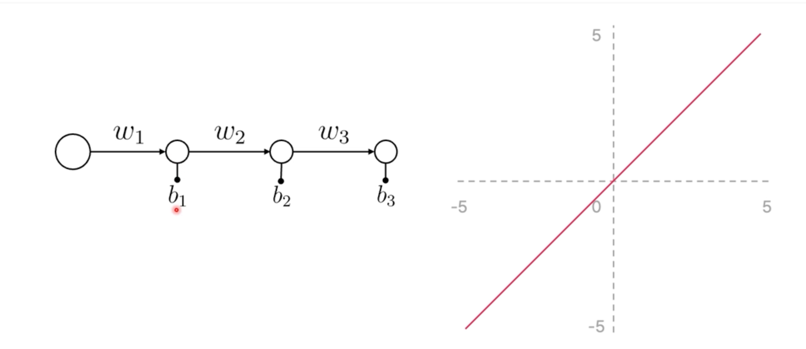  
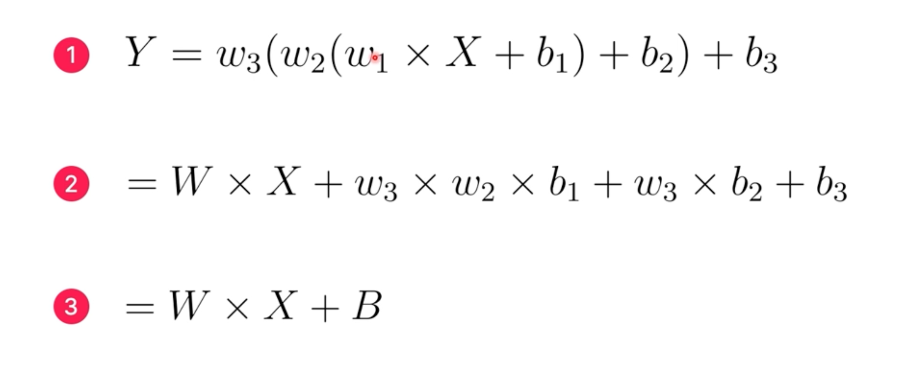

* 문제점
  * 활성함수가 선형 함수일 경우, 깊은 신경망 구성의 효과 기대할 수 없다.  
    (위에서 본 것 처럼 여러 층을 구성하더라도 수식적으로 볼때, 하나의 층을 가진 신경망과 동일한 효과를 가짐)  
  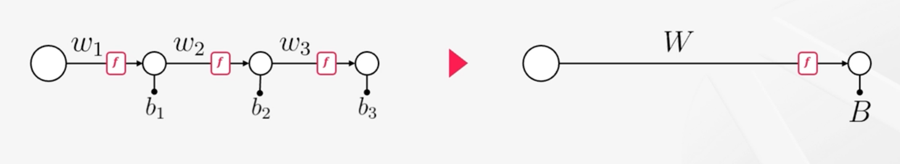

`활성함수는 비선형 함수를 사용해야 한다.`

* 활성함수의 특징
  * 활성함수는 신경망의 깊은 층의 신호를 효과적으로 전달하기 위해 사용
  * 비선형 함수 -> 깊은 층의 신호 전달 효과를 보기 위해서는, 비선형 함수를 채택해야함.
  * 레이어가 깊어질 수록 효과 극대화 -> 신경망 구조가 싶을 수록 각 뉴련의 신호가 정밀한 특징을 바탕으로 하여 효과적
  * 임계치 기준 존재 -> 각 활성함수는 신호 활성화의 기준이 존재, 특정 임계치를 초과할 때 신호 강도 증가.
  * 각 층마다 별도의 활성함수 사용가능 -> 신경망의 층마다 활성함수를 별도로 적용 가능

* 활성함수 종류  


#### ReLU(Rectified Linear Unit) 활성함수    
  
* 음수 입력값은 0, 양수 입력값은 그대로 반환
* 음수값을 0으로 보정시켜주는 activation function  

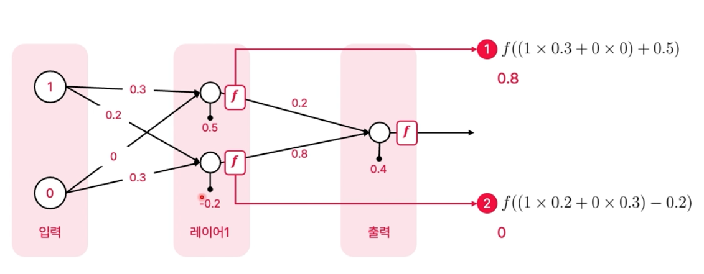  
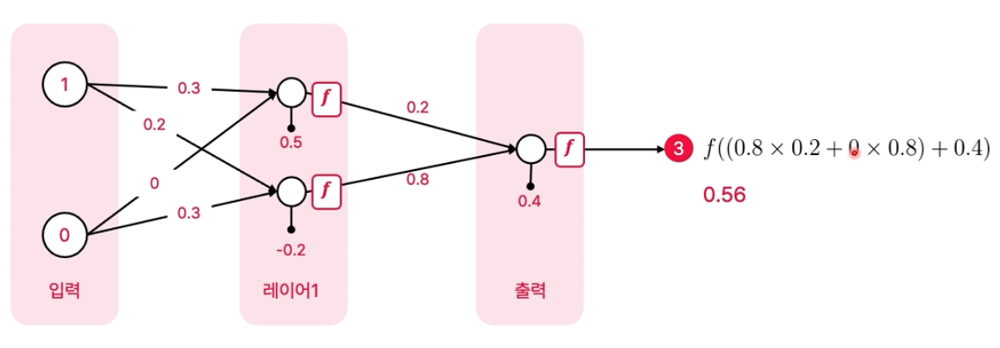  

### 순전파(feed-forward) & 역전파(back-propagation)  
  
#### 순전파(feed-forward)  
```python
class Net(nn.Module):
    def __init__(self, input_size, hidden_size, num_classes):
        super(Net, self).__init__() # nn.Module 클래스의 생성자 호출
        self.fc1 = nn.Linear(input_size, hidden_size) # 첫번째 히든 레이어
        self.relu = nn.ReLU() # 활성화 함수
        self.fc2 = nn.Linear(hidden_size, num_classes) # 두번째 히든 레이어

    def forward(self, x):
        out = self.fc1(x) # 첫번째 히든 레이어를 통과한 결과
        out = self.relu(out) # 활성화 함수를 통과한 결과
        out = self.fc2(out) # 두번째 히든 레이어를 통과한 결과
        return out
```
* 순방향 신경망(Feedforward Neural Network)
* 순환 신경망(Recurrent Neural Network)  
  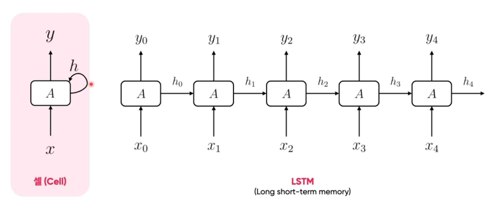

#### 역전파(back-propagation)
```python
for epoch in range(num_epochs):
    for i,(images, labels) in enumerate(train_loader):
        images = Variable(images.view(-1, 28*28)) #.cuda() # 28 * 28 이미지를 1차원 벡터로 변환
        labels = Variable(labels)#.cuda()

        optimizer.zero_grad() # 기울기 초기화
        outputs = net(images) # 모델에 이미지 입력
        loss = loss_function(outputs, labels) # 손실 계산
        loss.backward() # 역전파 결국 가중치를 재조정하는 연산  <<<<--------------- 역전파
        optimizer.step() # 최적화

        if (i+1) % 100 == 0:
            print('Epoch [%d/%d], Step [%d/%d], Loss: %.4f' % (epoch+1, num_epochs, i+1, len(train_data)//batch_size, loss.data))
```
* 역전파의 과정
  * 역전파는 신경망의 예측치와 실제 정답의 차이 값, Loss를 바탕으로 신경망의 패턴을 재조정 하는 과정
  * 신경망의 패턴이란, 신경망을 구성하는 각 뉴련들의 가중치(weight)와 편향(bias)을 재조정하는 과정 의미

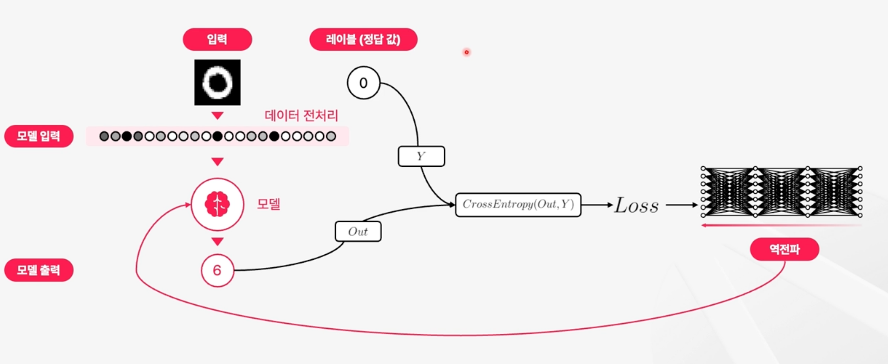

* 역전파 원리
  * 역전파는 합성함수의 도함수를 구하는 과정
  * 연결된 뉴런들의 가중치와 편향을 통해 계산하는 과정은 합성함수
  * 이를 역으로 계산하는 과정은 미분의 연쇄법칙  

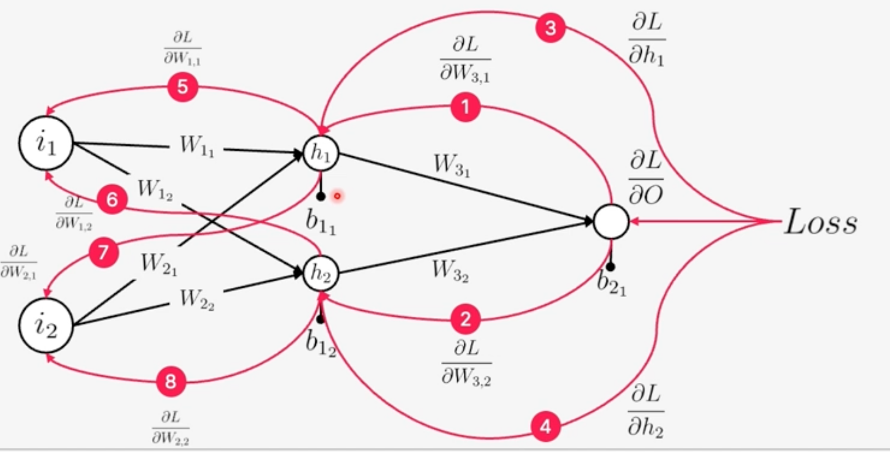

* 역전파 연쇄법칙(chain rule)  
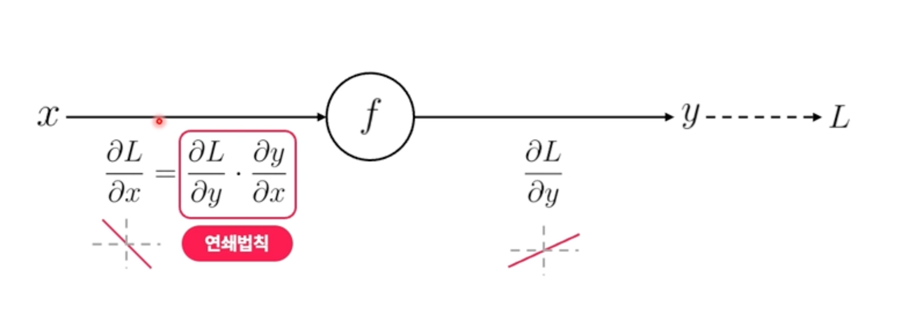
 

### XOR 예측 문제  
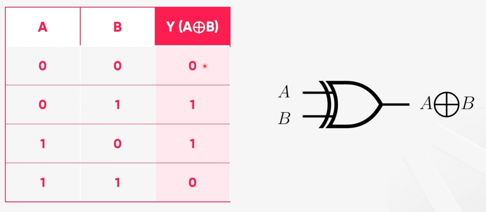
* 위 신경망에서 출력 모델은 1개 (Sigmoid)
  * Sigmoid 0 ~ 1의 값을 출력
  * 0.5를 기준으로 0.5보다 극단적으로 1에 가까운 값을 출력
  * 0, 1을 분류하는 binary classification 문제에 적합

* 순전파  
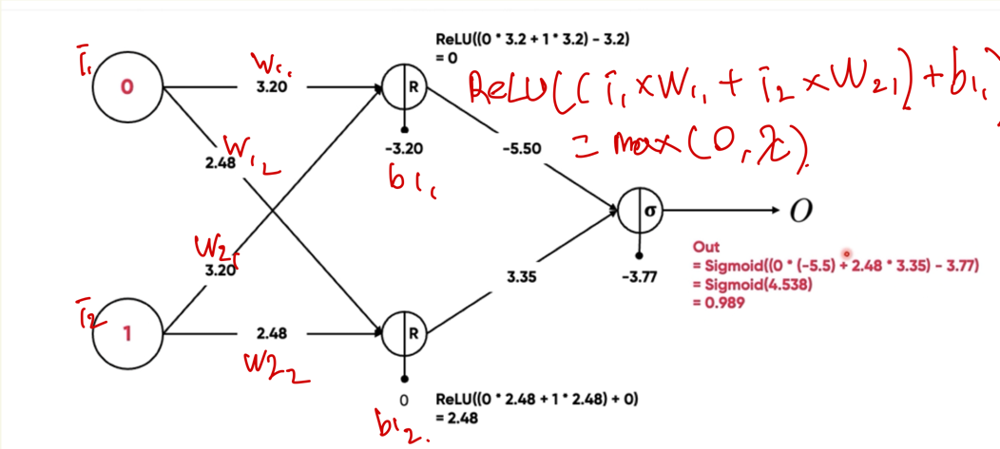  

```python 
def forward_propagation(
        X: np.ndarray,
        parameters: dict[str, np.ndarray],
) -> tuple[np.ndarray, np.ndarray]:
    W1 = parameters["W1"]
    b1 = parameters["b1"]
    W2 = parameters["W2"]
    b2 = parameters["b2"]
    
    Z1 = np.dot(W1, X) + b1
    A1 = relu(Z1)
    
    Z2 = np.dot(W2, A1) + b2
    A2 = sigmoid(Z2)
    
    return A1, A2
```  
* 역전파 
  * 출력에서 입력방향으로 가중치, bias를 업데이트
  * weight와 bias를 어떻게 업데이트해야 최종값인 loss값이 줄어드는지 관심 loss값 = 예측값과 실제값이 얼마나 차이나는지  
  
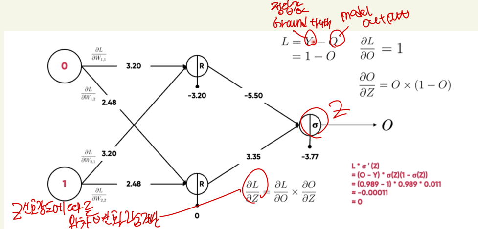  

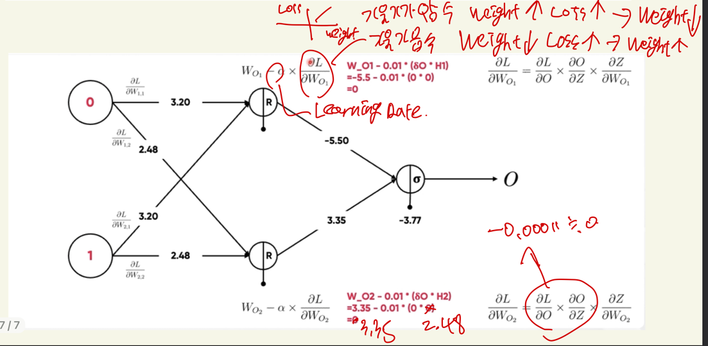  

```python
def backword_propagation(
        parameters: dict[str, np.ndarray],
        A1: np.ndarray,
        A2: np.ndarray,
        X: np.ndarray,
        Y: np.ndarray,
) -> dict[str, np.ndarray]:
    m = X.shape[1]
    W2 = parameters["W2"]

    dZ2 = (A2 - Y) * A2 * (1 - A2)
    dW2 = np.dot(dZ2, A1.T) / m
    db2 = np.sum(dZ2, axis=1, keepdims=True) / m
    dZ1 = np.dot(W2.T, dZ2) * (A1 > 0)
    dW1 = np.dot(dZ1, X.T) / m
    db1 = np.sum(dZ1, axis=1, keepdims=True) / m

    gradients = {
        "dW1": dW1,
        "db1": db1,
        "dW2": dW2,
        "db2": db2,
    }
    return gradients
```  
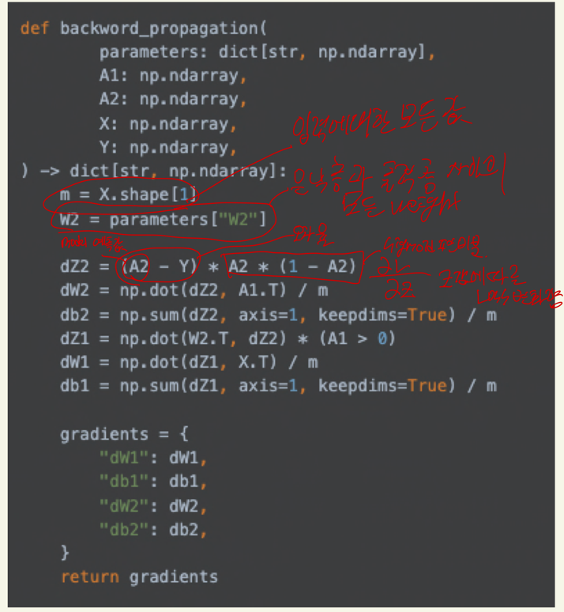

```python
def update_parameters(
        parameters: dict[str, np.ndarray],
        grads: dict[str, np.ndarray],
        learning_rate: float = 0.01,
)-> dict[str, np.ndarray]:
    parameters["W1"] -= learning_rate * grads["dW1"]
    parameters["b1"] -= learning_rate * grads["db1"]
    parameters["W2"] -= learning_rate * grads["dW2"]
    parameters["b2"] -= learning_rate * grads["db2"]

    return parameters
```  

* weight 대비 loss가 많이 오르면 weight를 많이 낮추는 결정을 해야함
* weight에 대해 loss의 편미분 값이 높으면 그만큼 weight를 낮춰야함
* 기울기에 학습률을 곱한 값을 역전 시켜서 weight, bias를 업데이트
 