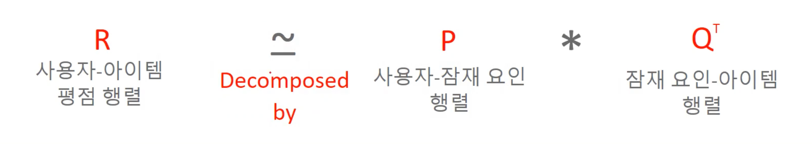

## 잠재 요인 협업 필터링
* 잠재 요인 협업 필터링은 사용자 - 아이템 평점 행렬 속에 숨어 있는 잠재 요인을 추츨해 추천 예측을 할 수 있게 하는 기법
* 대규모 다차원 행렬을 svd와 같은 행렬 분해 기법으로 분해하는 과정에서 잠재 요인을 추출하는데, 이 잠재요인을 기반으로 사용자 - 아이템 평점 행렬을 재 구성하면서 추천 구현

## 행렬 분해를 통한 잼재 요인 협업 필터링
* 잠재 요인 협업 필터링의 행렬 분해  

* 잠재 요인 협업 필터링의 행렬 분해 목표는 희소 행렬 형태의 사용자-아이템 평점 행렬을 
* 밀집(dense) 행렬 형태의 사용자-잠재 요인 행렬과 잠재 요인-아이템 행렬로 분해 한 뒤 
* 이를 재 결합하여 밀집 행렬 형태의 사용자-아이템 평점 행렬을 생성하여 사용자에게 새로운 아이템을 추천 

## 사용자-아이템 평점 행렬 분해 이슈
* SVD는 Missing value가 없는 행렬에 적용 가능 -> 경사 하강법(Gradient descent)를 이용 P와 Q에 기반한  
예측 R 값이 실제 R값과 가장 최소의 오류를 가질 수 있도록 비용함수 최적화를 통해 P와 Q를 최적화 유추 

## 사용자 기반 CF와 아이템 기반 CF

|     사용자 기반 CF      |     아이템 기반 CF      |
|:------------------:|:------------------:|
| 데이터가 풍부한 경우 정확한 추천 |       계산이 빠름       |
|   결과에 대한 위험성 존재    | 업데이트에 대한 결과 영향이 적음 |

* 데이터 크기가 적고, 사용자에 대한 정보가 있는 경우 사용자 기반 CF가 적합
* 데이터 크기가 크고, 아이템에 대한 정보가 있는 경우 아이템 기반 CF가 적합

