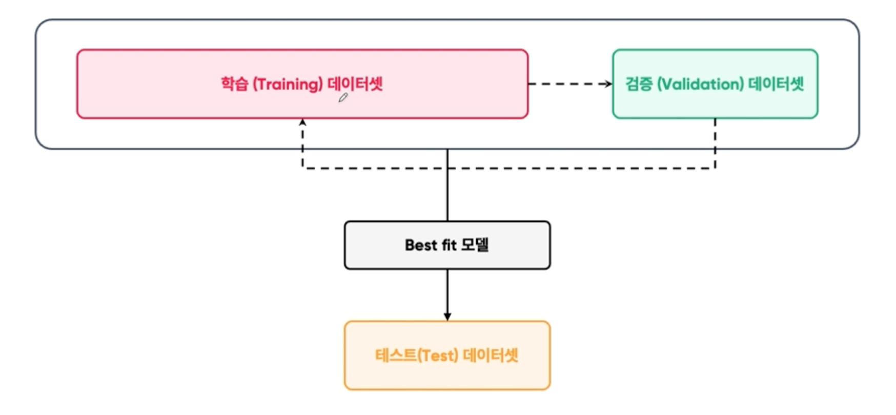

# 모델 평가

## 모델 검증(Model Validation) 과정  

## 모델 주요 평가 매트릭  

### 분류 성능 평가 지표  

### 정밀도 (Precision)와 재현율 (Recall)  

* 정밀도와 재현율의 차이

|    |                  정밀도                  |                     재현율                     |
|:--:|:-------------------------------------:|:-------------------------------------------:|
| 정의 | 모델이 평가한 것 중  제대로 맞은 비율이 어느정도 되는가? | 실제 positive 데이터 중  모델이 맞춘 비율이 어느정도 되는가? |
| 목적 |  모델이 잘못 예측한 positive를 줄이고자 하는 것에 집중   |     실제 positive 데이터 중 모델이 놓치는 것이 없도록 집중     |

## F1 Score   

## 모델 평가 과정 - Model Drift
  
* 모델이 잘 학습되었더라도, 실제 분포와 다를 수 있다.
* 이때 발생하는 차이를 드리프트(Drift)라고 한다.