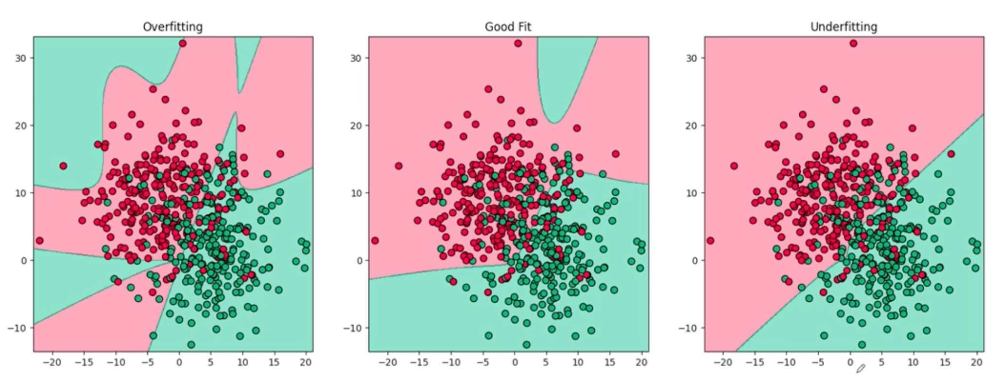
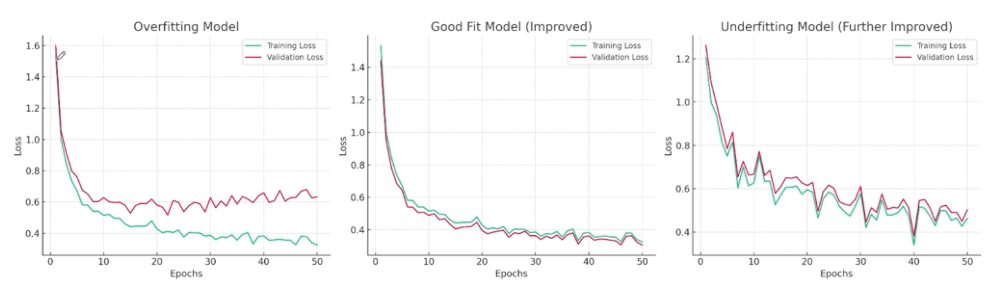
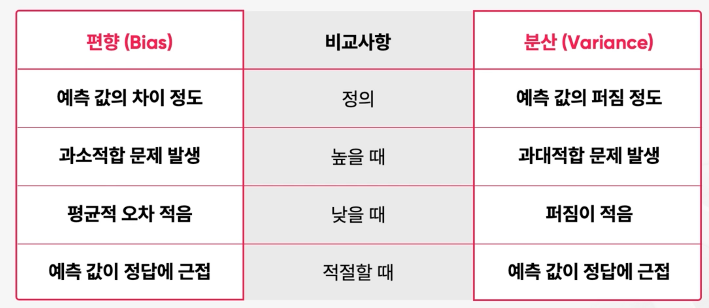
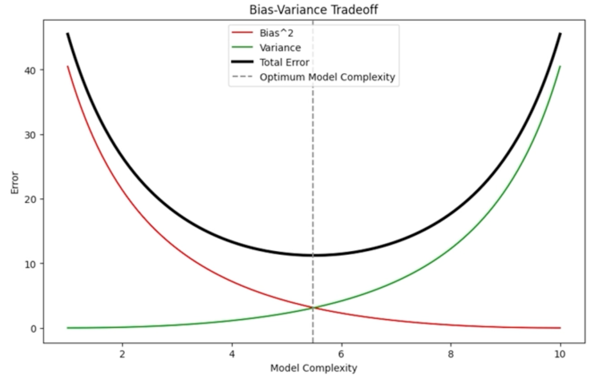
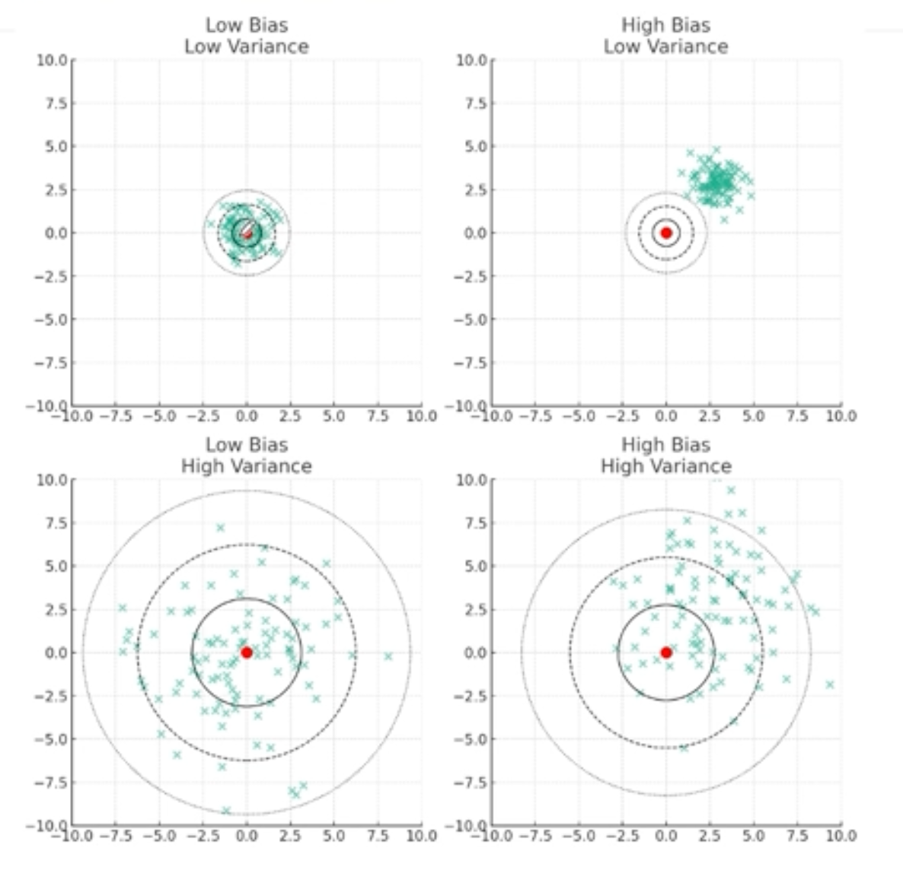
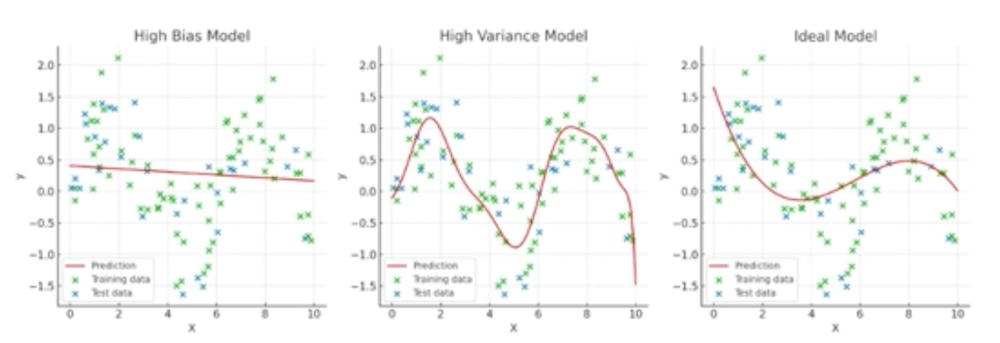

## 과대적합(Overfitting)과 과소적합(Underfitting)

* 과대적합과 과소적합의 loss
  
  * 과대적합 (좌측)은 Validation에서 loss가 극명하게 오르는 것을 볼 수 있고
  * 과소적합 (우측)은 Training set과 Validation set이 유사하나 시간이 지나도 loss를 줄이지 못하고 있는 양상을 보인다.
  
* 과적합이 발생하는 이유
  * 모델의 복잡도가 높을 때
  * 모델 학습으로 주어진 데이터가 적을 때
  * 모델 학습에 사용하는 데이터의 노이즈가 많을 때
  * 필요한 모델 학습 시간보다 너무 과도하게 길게 학습할 때
  * 모델 학습과 테스트 데이터를 적절하게 분리하지 못했을 때

## 편향(Bias)과 분산(Variance)  

* 편향과 분상의 상충관계  
    
   

